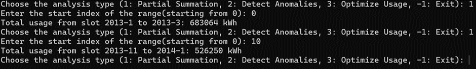
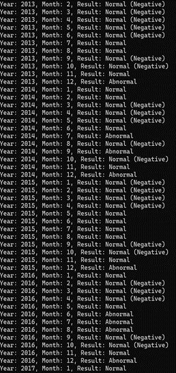
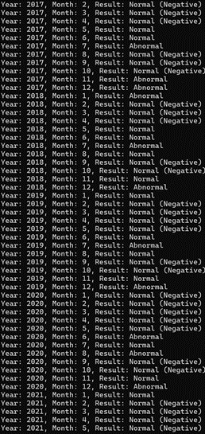
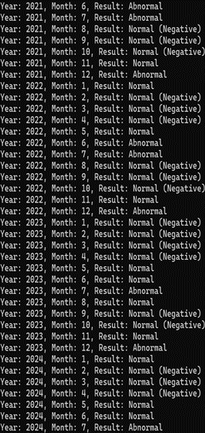

# 동형암호 기반 에너지 사용 분석 시스템

Microsoft SEAL 라이브러리를 활용하여 에너지 사용 데이터를 암호화된 상태에서 분석 및 최적화하는 시스템입니다. 데이터 프라이버시를 보호하면서도 유용한 정보를 추출할 수 있는 동형암호 기술을 구현했습니다.

---

## 목차

1. [프로젝트 개요](#프로젝트-개요)
2. [주요 기능](#주요-기능)
3. [설치 방법](#설치-방법)
4. [사용법](#사용법)
5. [한계](#한계)
6. [참고자료](#참고자료)

---

## 프로젝트 개요

- **연구 배경:** 데이터 기반 의사결정의 중요성이 증가하면서 에너지 사용 데이터를 안전하게 분석할 필요성이 커지고 있습니다. 동형암호는 데이터를 암호화된 상태에서 분석할 수 있는 기술로, 데이터 프라이버시를 유지하면서 분석이 가능합니다.
- **연구 목적:** Microsoft SEAL 라이브러리를 활용하여 암호화된 에너지 데이터를 분석 및 최적화하고, 민감한 정보를 안전하게 처리하는 시스템을 구현합니다.

---

## 주요 기능

- **데이터 암호화**  
  에너지 사용 데이터를 암호화하여 프라이버시를 보호합니다.

- **구간 합산**  
  사용자가 지정한 범위의 월별 사용량 합계를 암호화된 상태에서 계산합니다.

- **이상 패턴 탐지**  
  비정상적인 에너지 사용 증가 패턴을 탐지합니다.


---

## 설치 방법

1. **필수 조건**
    - C++17 이상 지원 컴파일러 필요
    - [Microsoft SEAL 라이브러리 설치](https://github.com/microsoft/SEAL)

2. **CSV 데이터 준비**
    - 프로젝트 디렉토리에 `한국소비자원_에너지 사용량 (전기)_20240731.csv` 파일 추가

3. **컴파일**
   ```bash
   g++ main.c -o energy_analysis -lseal -std=c++17

---

## 사용법

1. **CSV 파일 준비**
    - `한국소비자원_에너지 사용량 (전기)_20240731.csv` 파일을 프로젝트 디렉토리에 추가

2. **프로그램 실행**
   ```bash
   ./energy_analysis
   ```

3. **분석 메뉴 선택**
    - **옵션 1**: 특정 구간의 월별 사용량 합산
        - 시작 인덱스를 입력하면 지정한 구간의 암호화된 사용량 합계를 복호화하여 출력
      
    - **옵션 2**: 비정상적인 에너지 사용 패턴 탐지
        - 암호화된 데이터를 기반으로 급격한 사용량 증가를 탐지하고 결과를 복호화하여 출력
      <div style="display: flex; gap: 10px;">
          
          
          
        </div>
      
---

## 한계

- **정밀도 손실**  
  동형암호 연산 과정에서 발생하는 정밀도 손실로 인해 오차가 발생합니다.

- **성능 제한**  
  암호화된 데이터 처리 시 연산 속도가 평문 데이터 대비 느릴 수 있습니다.


---


## 참고자료

- **[Microsoft SEAL 라이브러리](https://github.com/microsoft/SEAL)**
- **공공데이터포털**: [한국소비자원 에너지 사용량 데이터](https://www.data.go.kr/data/15100589/fileData.do)
