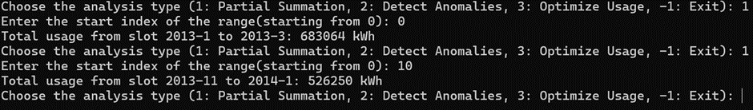
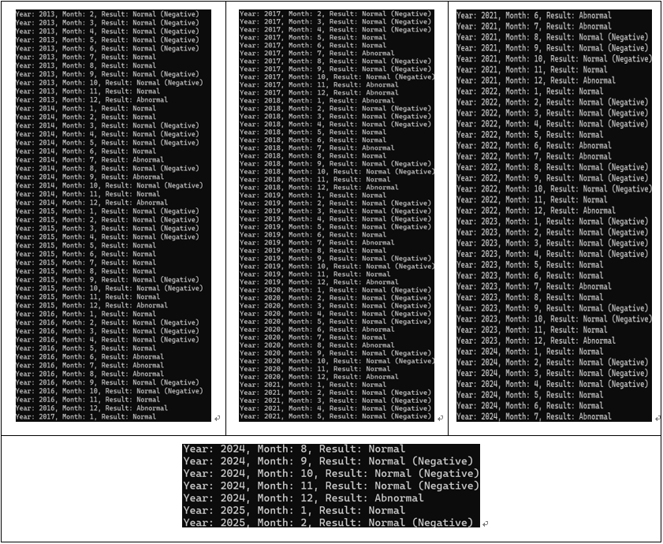
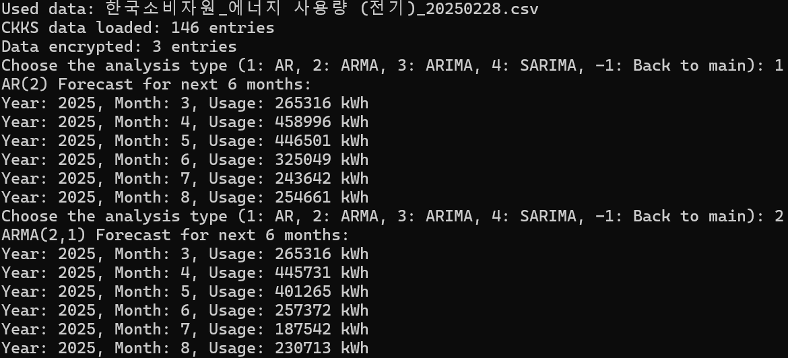
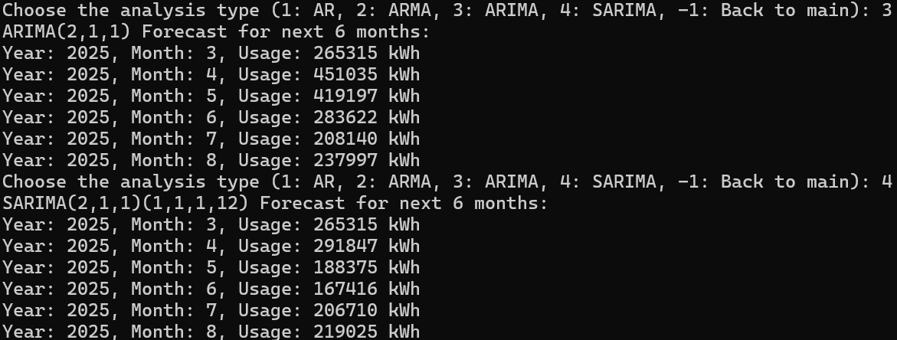
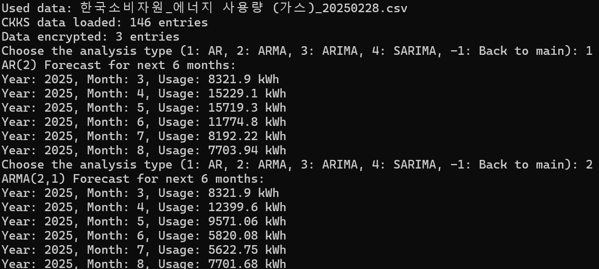
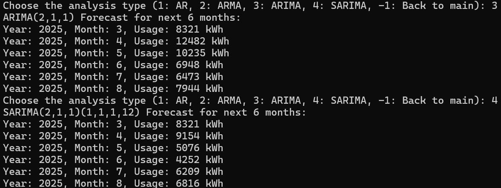

# 동형암호 활용 에너지 사용 분석 시스템

Microsoft SEAL 라이브러리를 활용하여 **에너지 사용 데이터를 암호화된 상태에서 분석 및 시계열 예측**하는 시스템입니다.
데이터 프라이버시를 보호하면서도 유용한 통계와 예측 정보를 제공합니다.

---

## 개발 환경


* **IDE**: Visual Studio 2022
* **라이브러리**: Microsoft SEAL
* **데이터**: 한국소비자원 전기/가스 사용량 (공공데이터포털 제공)

---

## 라이선스


---

## 목차

1. [프로젝트 개요](#프로젝트-개요)
2. [주요 기능](#주요-기능)
3. [설치 방법](#설치-방법)
4. [사용법](#사용법)
5. [실행 결과](#실행-결과)
6. [한계](#한계)
7. [참고자료](#참고자료)

---

## 프로젝트 개요

* **연구 배경:**
  에너지 사용 데이터는 민감 정보와 직결되며, 안전한 분석 방법이 필요합니다. 동형암호(FHE)는 암호화된 상태에서도 연산을 수행할 수 있어, 데이터 보안과 분석을 동시에 충족합니다.

* **연구 목적:**
  Microsoft SEAL 라이브러리를 활용하여 암호화된 에너지 사용 데이터를 기반으로 **합산, 이상탐지, 시계열 예측** 기능을 지원하는 시스템을 개발합니다.

---

## 주요 기능

* **데이터 암호화**: 전기/가스 사용 데이터를 BFV(정수), CKKS(실수) 스킴으로 암호화
* **구간 합산**: 사용자가 지정한 범위의 월별 사용량 합계를 암호화 상태에서 계산
* **이상 탐지**: 급격한 사용량 증가/감소 탐지
* **시계열 예측**:

  * AR (자기회귀)
  * ARMA (자기회귀+이동평균)
  * ARIMA (차분 포함)
  * SARIMA (계절성 포함)

---

## 설치 방법

1. **필수 조건**

   * C++17 이상 컴파일러
   * [Microsoft SEAL](https://github.com/microsoft/SEAL) 설치

2. **CSV 데이터 준비**

   * `한국소비자원_에너지 사용량 (전기)_20240731.csv`
   * `한국소비자원_에너지 사용량 (가스)_20250228.csv`
   * 프로젝트 디렉토리에 추가

---

## 사용법

1. **프로그램 실행**

   ```bash
   ctrl + F5
   ```

2. **스킴 선택**

   * `1`: BFV (정수, 전기 데이터)
   * `2`: CKKS (실수, 전기/가스 선택 가능)

3. **분석 기능**

   * BFV 모드:
     `1`: 구간 합산
     `2`: 이상 탐지
   * CKKS 모드:
     `1`: AR, `2`: ARMA, `3`: ARIMA, `4`: SARIMA

---

## 실행 결과

| 분석 종류     | 결과 이미지 |
|--------------|------------|
| 구간 합산     |  |
| 이상 탐지     |  |
| AR 예측      |  |
| ARMA 예측    |  |
| ARIMA 예측   |  |
| SARIMA 예측  |  |


---

## 한계

* **정밀도 손실**: CKKS 스킴에서 발생하는 스케일링 및 모듈러 연산 오차
* **성능 제한**: 암호화 연산 특성상 실행 시간이 평문 대비 느림
* **오차 발생**: 구간 합산에서 ±50,000 kWh 정도의 오차 발생

---

## 참고자료

* **[Microsoft SEAL 라이브러리](https://github.com/microsoft/SEAL)**
* **공공데이터포털**: [한국소비자원 에너지 사용량 데이터](https://www.data.go.kr/data/15100589/fileData.do)